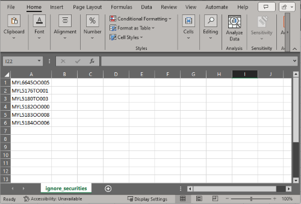

# README FOR EXCHANGE DATA SERVICE

## Application description

The intended usage of this application is for a set of exchange to fetch data from the exchange's website. 
Data points can be fetched for all exchanges (e.g. the short sell indicator) or exchange specific (e.g. intraday trading flag for Taiwan). 
An exchange represents mostly a country with one or multiple MIC codes. Some codes represent one specific exchange. 
For all the securities from each of these exchanges the attribute *shortSellEligibleFlag* will be set to '*Y*'. 
Each security will be searched in UDM for a corresponding security, sourced from Refinitiv DataScope Equities (trdse). 
From the trdse security the following attributes will be added to the exchange's security:
* ric
* exchangeTicker
* isin
* sedol
* segmentMic
* tradeCurrencyCode
* nameLong
* docId
* _securityId

The combined data will be written into a json file with the following keys:
* exchange_id
* source
* mic_code
* long_name
* isin
* sedol
* ric
* trade_currency
* lookup_attr
* lookup_attr_val
* doc_id
* sec_id
* security_unique_id (which is concatenation of the mic_code and the lookup_attr_val)
* instrument_unique_id (which is concatenation of the source and the lookup_attr_val)
* security_status
* exchange_fields:
  * short_sell
  * intraday_trading (for Taiwan)
  * stock_connect (for hkex_stockconnect)
 

From this data a feed file will be generated which will serve as input for the `rduEds` (acronym for *RDU Exchange Data Service*) datasource UDL loader to 
load the data in UDM. The addition of the trdse data points allows the security to be cross-referenced with other sources and let the data flow to 
proforma and distribution. In case there are no short sell eligible securities for that particular source then an empty file (with just a header
record) will be created. If something goes wrong processing, no file will be created.

In case a corresponding trdse can't be found for a security extracted from the exchange's website, then an exception service desk ticket will be 
created. 
This allows Operation to look into the data and manually fix it if required.

Securities which initially were short sell eligible (or were in scope with another field, like stock connect eligibility) but are not eligible anymore
should be marked as 'inactive' in sdData. 
To achieve this the generated list of instrument_unique_ids is compared with the instrumentSourceUniqueIds for the `rduEds`. 
For instrumentSourceUniqueIds in sdData which are not included in the generated list of instrument_unique_ids from the website,
a skeletal record is added in the generated json feed file where the security_status is 'inactive'. 
Processing this record will update the status in sdData for that instrument and embedded security to I - Inactive.

## Installation and requirements
The application is written in Python and requires version 3.8[^1] or higher. The following side packages (also listed in the ```requirements.txt```) 
need to be installed:

* pymongo
* requests
* bs4
* beautifulsoup4
* playwright
* pandas
* tabula-py
* xlrd
* pdfminer.six
* pytz

[^1]: The application has been tested versus Python 3.8 and 3.9.

Side packages can be installed by running:
```python -m pip install -r requirements.txt```

## Configuration

The application uses one configuration file, i.e. ```configurations.ini``` located in the root folder of the project. After installation the 
following properties need to be reviewed and updated to usage and the installation environment:

### LOGGING section:
- **log_dir**: folder where to write the log file to. Make sure the application has the proper write to this folder!
- **level**: level of logging. In production the recommended setting is INFO.
- **root_filename**: the log file consists of a rootfile name suffixed with a datetime. The root filename can be configured using this property. 
The filename will look like: ```exchange_data_2022-12-21161847.log```

### CONNECTION section:

Provide the connection details of the server where the ```trdse``` data is stored and where the ```rduEds``` data needs to be stored on.

### PROCESSING section:
* **website_timeout**: time in milliseconds in which the website must reply before generating a time-out error
* **output_file_sep**: in case the output format is csv this will be the separator character. Note: semicolon needs to be quoted, since this is 
a special character for an `.ini` file. 
* **resource_root_dir**: location where intermediate files from a website need to be stored before being processed. 
For example, in case the short sell data comes in a downloadable csv or pdf file. Note that for each exchange a separate subfolder will be created 
in this folder!
* **output_file_dir**: location where the generated feed files will be stored.

***Important: do not update other properties, since this may cause the application to crash!***

## Usage

The application is intended to be run periodically. Any scheduler supporting Python application can be used, or you can create your own 
scheduler. 

The application takes the following arguments:

1 ```-c```, ```--source_codes``` (mandatory)

The value for this argument is one source code or a list of comma separated source codes from supported exchanges. 
For example: ```--source_codes=borsa_istanbul,egx,hkex,saudi_exchange```

In case invalid codes are specified then these will be logged.

In case all the sources need to be processed then the option ```all_codes``` can be used. In this case all the source codes supported will be 
processed.
The argument in this case is: ```--source_codes=all_codes```

2 ```-o```, ```--out_format``` (optional, default *json*)

Specify the format of the output file, either *json* (by default) or *csv*.

3 ```-e```, ```--enrich_data``` (optional, default *y*)

Option for testing and development purposes only! In case set to ```n``` the data from the exchange will not be enriched with ```trdse``` data from the 
database.

4 ```-j```, ```--create_jira``` (optional, default *y*)

Option for testing and development purposes only! In case set to ```n``` no Jira issues will be created in case no corresponding ```trdse``` security
is found in the database.

Since the application can be executed by running the ```main``` module, the run command then would be:

```python -m main --source_codes=all_codes```

## Manual corrections and input  

This section describes non-default functionality for a particular source or generically.

### Manual input

In case the tool is not able to (correctly) fetch the data from the website, the manual input Excel can be used to create manual records.
This can be done by listing all the exchange ids for that particular data source, including the data fields like short_sell and after that
running the embedded macro.
The tool will then generate a similar feed file as the automated tool would do. 
This generated file would then need to be copied to the daq location so that UDL can pick up the file for processing into the system.
More details on how the use the Excel is within the Excel itself.

### Ignored securities
There might be cases where a security needs to be ignored, despite being part of the securities list fetched from the website. 
An encountered use case is a security on Bursa Malaysia which is eligible for short sell, however, suspended for trading.
In this case this security needs to be de-activated, so it's not included in the distribution file.

In order to specify a security to be ignored from the output a csv file needs to be created with the name ```ignore_securities.csv``` and stored
in ```<project root folder>/exchange_files/<edDataSourceCode>/resources/``` folder. 
So for example for Malaysia the full path would be: ```<project root folder>/exchange_files/bursa_malaysia/resources/ignore_securities.csv```.

The file should list the exchange ids which should be ignored in the first column. This column should **not** have a header. 
So it would just look like:




### bolsa_de_santiago
The website of Bolsa de Santiago has bot detection mechanism. Therefore, scraping might sometimes fail.

### bolsa_chile
Besides extracting short sell securities eligible list from the website of Bolsa De Santiago for MIC code XBLC a list is being mailed by the exchange
containing a list of short sell eligible securities for that MIC code. In order to process these securities the mailed list needs to be copied
to a file and saved as a csv file without header. So it will just contain a list of tickers. The filename of this file is expected to contain
the MIC code (i.e. XBLC) and have .csv as extension. So for example ```XBCL-list.csv```. It needs to be saved in the chile source downloads folder,
so ```<project root folder>/exchange_files/chile/downloads/```.

### taiwan
Taiwan currently covers two edDataSourceCodes: 
 * twse
 * tpex

The short sell and intraday eligible data of the Taiwan Stock Exchange delivered in files. However, since the website has protected by reCaptcha 
it's not possible to programmatically download these files. Below a desription how to get the files.

#### twse
The files for twse need to be downloaded manually and stored in the exchange specific download folder, i.e. 
`<root folder>/exchange_files/twse/downloads`. The script picks up the file from that location and after processing moves them 
in the `archive` subfolder.

The files can be downloaded from the website https://eshop.twse.com.tw/en/member/index. 
After logging in navigate to *Download Area* and follow the link of the latest available date. For that date download the 
 * A37E_TWTB4U-*<date>*-E.csv (intraday trading tickers) 
 * A42E_TWT96U-*<date>*-E.csv (short sell tickers) 
where *<date>* represents the current date.
The downloaded files need to be copied over to the specific download folder mentioned above.

#### tpex
Also for tpex the files also need to be downloaded manually and copied to the exchange specific download folder, i.e. 
`<root folder>/exchange_files/tpex/downloads`.
The script picks up the file from that location and after processing moves them in the `archive` subfolder.

Tpex uses the same short sell file as twse, i.e. `A42E_TWT96U-*<date>*-E.csv` where *<date>* represents the current date.
So this file needs to be copied over to the specific download folder mentioned above.
In addition, the file `DayTradeMark.CSV` needs to be downloaded. 
This file contains the intraday trading data for mic code ROCO. 
The file can be downloaded from https://intd.tpex.org.tw/. 
After login in navigate to the *File Download* section and click on *DayTradeMark.CSV*.
Also, this file needs to be copied the specific download folder mentioned above.

## Known issues

At this moment there are no issues known. If you encounter issues or have questions, please contact:

- [Marc de Vent](mailto:marc.devent@smartstreamrdu.com) or
- [Jaime Rengifo](mailto:jaime.rengifo@smartstreamrdu.com)

## Appendix: supported exchanges

The following exchanges are supported.
See also https://smartstream.atlassian.net/wiki/spaces/DMS/pages/29910717/Overview+of+Process for details on extracting short sell data.

| Region  | source            | MIC code(s) | Update frequency [^1] | Validations                | Comments                                                                          |
|---------|-------------------|-------------|-----------------------|----------------------------|-----------------------------------------------------------------------------------|
| Oceania | nzx               | XNZE        | Daily                 |                            |                                                                                   |
| America | bvl               | XLIM        | Quarterly             | Expected tickers vs. reply |                                                                                   |
| America | byma              | XBUE        | Daily                 |                            |                                                                                   |
| America | bolsa_de_santiago | XSGO        | Quarterly             |                            |                                                                                   |
| America | bolsa_chile         | XBCL        | Monthly               |                            | Mail feed: create csv file from list (having XBCL in filename, e.g. XBCL-list.csv |
| Asia    | twse              | XTAI        | Daily                 |                            | Also support for intraday trading eligible. See [Taiwan](#taiwan)                 |
| Asia    | tpex              | ROCO        | Daily                 |                            | Also support for intraday trading eligible. See [Taiwan](#taiwan)                 |
| Asia    | pse               | XPHS        | Daily                 |                            |                                                                                   |
| Asia    | hkex              | XGEM        | Daily                 |                            |                                                                                   |
| Asia    | hkex              | XHKG        | Daily                 |                            |                                                                                   |
| Asia    | bursa_malaysia    | XKLS        | Semi-annually         |                            |                                                                                   |
| Asia    | idx               | XIDX        | Monthly               |                            |                                                                                   |
| Asia    | set               | XBKK        | Daily                 |                            |                                                                                   |
| Asia    | set               | XMAI        | Daily                 |                            |                                                                                   |
| Asia    | cninfo            | XSHE        | Daily                 | Request vs. reply date     |                                                                                   |
| Asia    | cninfo            | XSHG        | Daily                 | Request vs. reply date     |                                                                                   |
| Asia    | hkex_stockconnect | XSEC        | Daily                 |                            | Also support to populate stock connect eligible                                   |
| Asia    | hkex_stockconnect | XSSC        | Daily                 |                            | Also support to populate stock connect eligible                                   |
| Asia    | shenzhen_sc       | XSEC        | Daily                 |                            |                                                                                   |
| Asia    | shanghai_sc       | XSSC        | Daily                 |                            |                                                                                   |
| Emea    | ads               | XADS        | Daily                 |                            | Filter out Short sell 'Not Allowed' and 'Disabled'. And Trading 'Suspended'       |
| Emea    | dfm               | XDFM        | Semi-annually         |                            |                                                                                   |
| Emea    | egx               | NILX        | Daily                 |                            |                                                                                   |
| Emea    | egx               | XCAI        | Daily                 |                            |                                                                                   |
| Emea    | borsa_istanbul    | XEQY        | Daily                 |                            |                                                                                   |
| Emea    | saudi_exchange    | XSAU        | Daily                 |                            |                                                                                   |

[^1]: Expected frequency at which source is updating the information on their website.